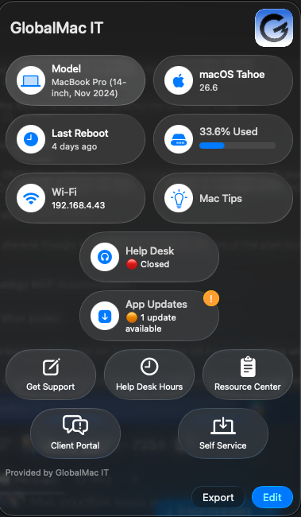

# Support App — Addigy Prebuilt App Updates

Show **Addigy Prebuilt App update status** inside the [Root3 Support App](https://github.com/root3nl/SupportApp), with a menu bar notification badge when updates are pending — **no Addigy API key required**.

This lets you surface the same "updates available" information that Addigy's **MacManage** app shows, directly in your branded Support App, so you can collapse to a single menu bar icon.


<!-- Add a screenshot at docs/screenshot.png -->

---

## What it does

- Adds an **"App Updates"** extension row to the Support App showing one of:
  - `✅ Up to date`
  - `🟠 N updates available` (clickable → opens MacManage to apply them)
- Lights up the **menu bar icon notification badge** when updates are pending, **proactively** (a LaunchDaemon refreshes it — the user doesn't have to open the app first).

## How it works

Addigy's agent maintains a local SQLite database of every Prebuilt App's state on each Mac — the **same source MacManage reads** for its update count. We just read it:

```
/Library/Addigy/ansible/prebuilt-apps/state.db   →   table: prebuilt_apps
    status = 'installed'   → app is current
    status = 'pending'     → update available
```

The database is world-readable and the agent refreshes it on every policy run (~30 min), so **no API call and no API key are needed**.

A small worker script counts the `pending` rows and writes the result to the Support App's preference domain (`nl.root3.support`). The Support App's extension mechanism renders that value, and the `*_alert` key raises the badge.

A LaunchDaemon runs the worker on load, on a 30-minute interval, and via `WatchPaths` the instant Addigy rewrites its state — so the badge appears on its own.

> **Badge color:** extension alerts show an **orange** badge. The Support App reserves **red** for pending macOS (Apple) software updates; it can't be assigned to a custom extension. The orange dot still appears on both the row and the menu bar icon.

## Requirements

- **Addigy** with the **Prebuilt Apps** feature in use (the `state.db` won't exist otherwise — the script handles that gracefully by showing `Not available`).
- **Root3 Support App** 3.x deployed, configured via the `nl.root3.support` profile.
- Your Support App profile must set **`StatusBarIconNotifierEnabled = true`** for the badge.

## Repository layout

| Path | What it is |
|---|---|
| `scripts/prebuilt_updates.zsh` | The worker — reads `state.db`, updates the extension + badge |
| `scripts/install_prebuilt_updates.zsh` | Installer — lays down the worker + LaunchDaemon and starts it (paste into an Addigy Script) |
| `launchd/com.example.prebuilt-updates.plist` | Reference copy of the LaunchDaemon (the installer writes this for you) |
| `profile/prebuilt_updates_item.xml` | The Extension `<dict>` to merge into your existing Support App profile |
| `profile/SupportApp-PrebuiltUpdates-sample.mobileconfig` | A minimal standalone sample profile if you don't have one yet |

## Install

There are two pieces: the **script** (on each Mac) and the **profile item** (so the app shows the row).

### 1. Deploy the worker + daemon
In Addigy, create a **Script** (or add to an existing Smart Software install script) scoped to your Support App devices, and paste the contents of [`scripts/install_prebuilt_updates.zsh`](scripts/install_prebuilt_updates.zsh). It runs as root and:
- writes `/Library/Management/Scripts/prebuilt_updates.zsh` (root:wheel, 755),
- writes and bootstraps the LaunchDaemon,
- populates the count immediately.

### 2. Add the row to your Support App profile
Merge the `<dict>` from [`profile/prebuilt_updates_item.xml`](profile/prebuilt_updates_item.xml) into the `Rows` → `Items` of your existing `nl.root3.support` profile, then re-push it.

> Don't deploy a second profile for the same `nl.root3.support` domain — two profiles managing one domain conflict. If you don't have a profile yet, start from [`profile/SupportApp-PrebuiltUpdates-sample.mobileconfig`](profile/SupportApp-PrebuiltUpdates-sample.mobileconfig).

Open the Support App — you'll see the **App Updates** row, and the menu bar badge will appear whenever apps are pending.

## Customize

| Setting | Where | Default |
|---|---|---|
| Daemon label (reverse-DNS) | `daemon_label` in the installer | `com.example.prebuilt-updates` |
| Log file | `log_path` in the installer | `/var/log/prebuilt_updates.log` |
| Row title / subtitle / icon | `profile/prebuilt_updates_item.xml` | "App Updates" / SF Symbol `arrow.down.app.fill` |
| Refresh interval | `StartInterval` in the daemon | `1800` (30 min) |

## Troubleshooting

- **Row is blank** → the profile points to a script that isn't on disk yet. Deploy step 1 first.
- **Row shows but no badge** → confirm `StatusBarIconNotifierEnabled = true` is in the profile.
- **Always "Not available"** → `state.db` doesn't exist; this Mac isn't using Addigy Prebuilt Apps.
- **Check the daemon:** `sudo launchctl print system/com.example.prebuilt-updates` — `state = not running` between runs is normal; look at `runs` and the `WatchPaths` entries.
- **Logs:** `/var/log/prebuilt_updates.log`.

## Credits

Built by [GlobalMac IT](https://globalmacit.com). Relies on the excellent [Root3 Support App](https://github.com/root3nl/SupportApp). Not affiliated with or endorsed by Addigy or Root3.

## License

[MIT](LICENSE) — use it, adapt it, ship it.
